# forTeams

# 프로젝트 소개

### 사내 MS Teams 활성화를 위한 MS Teams 가이드 챗봇 with 포스코인터내셔널

## 프로젝트 기간

```
2024.04.08 ~ 2024.05.17
```

## 팀원

<table>
    <tr height="140px">
        <td align="center" width="150px">
            <a href="https://github.com/madirony"></a>
            <br />
            <a href="https://github.com/madirony">♠️연정흠</a>
        </td>
        <td align="center" width="150px">
            <a href="https://github.com/seroh00"></a>
            <br />
            <a href="https://github.com/seroh00">노성은</a>
        </td>
        <td align="center" width="150px">
            <a href="https://github.com/waterlee6"></a>
            <br />
            <a href="https://github.com/waterlee6">이수민</a>
        </td>
        <td align="center" width="150px">
            <a href="https://github.com/qhdrnak"></a>
            <br />
            <a href="https://github.com/qhdrnak">김봉균</a>
        </td>
        <td align="center" width="130px">
            <a href="https://github.com/soyoungSoyoung"></a>
            <br />
            <a href="https://github.com/soyoungSoyoung">박소영</a>
        </td>
        <td align="center" width="150px">
            <a href="https://github.com/devjun20"></a>
            <br />
            <a href="https://github.com/devjun20">손준성</a>
        </td>
      <tr height="50px">
        <td align="center">
          <p>[BE]</p>
        </td>
        <td align="center">
          <p>[FE]</p>
        </td>
        <td align="center">
          <p>[FE]</p>
        </td>
        <td align="center">
          <p>[BE]</p>
        </td>
        <td align="center">
          <p>[Infra]</p>
        </td>
        <td align="center">
          <p>[AI]</p>
        </td>
    </tr>
    </tr>
</table>

## Youtube
[](https://www.youtube.com/watch?v=11lbwiMKRPs)

## 링크
https://forteams.co.kr/
<br /><br />
[](https://imaginary-pearl-3f3.notion.site/S204-forTeams-cfd9fd21699e4948a3a8533a9bb80376)

[](https://www.erdcloud.com/d/vQf9y3JcpRYwFKHk6)

[](https://www.figma.com/design/4MNk1tuUaO6pIvfV3N9TRM/forTeams?node-id=0%3A1&t=2EA75pePkTOaEuWH-1)

<br />

# 개발 환경 / 기술 스택

### COMMON


### FRONT


### BACK


### AI


### DEV TOOL & etc


# 기능 및 시연
## 기능
### 1. Markdown이 적용된 Chatbot
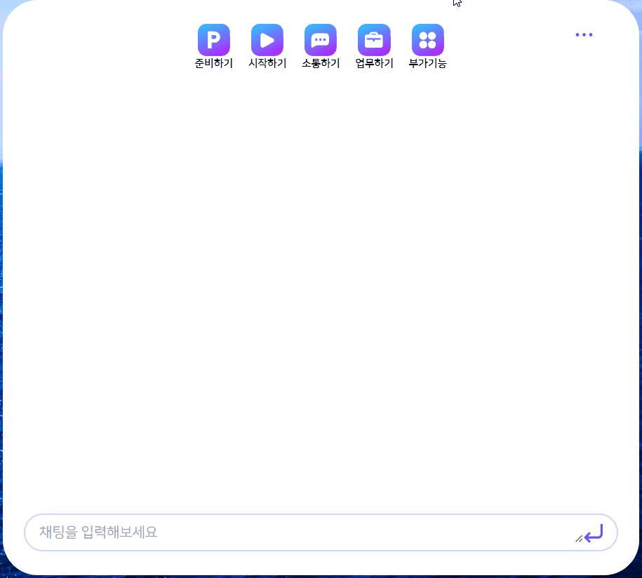
<br /><br />

### 2. 채팅 맥락 파악 후, 연관 질문 추천
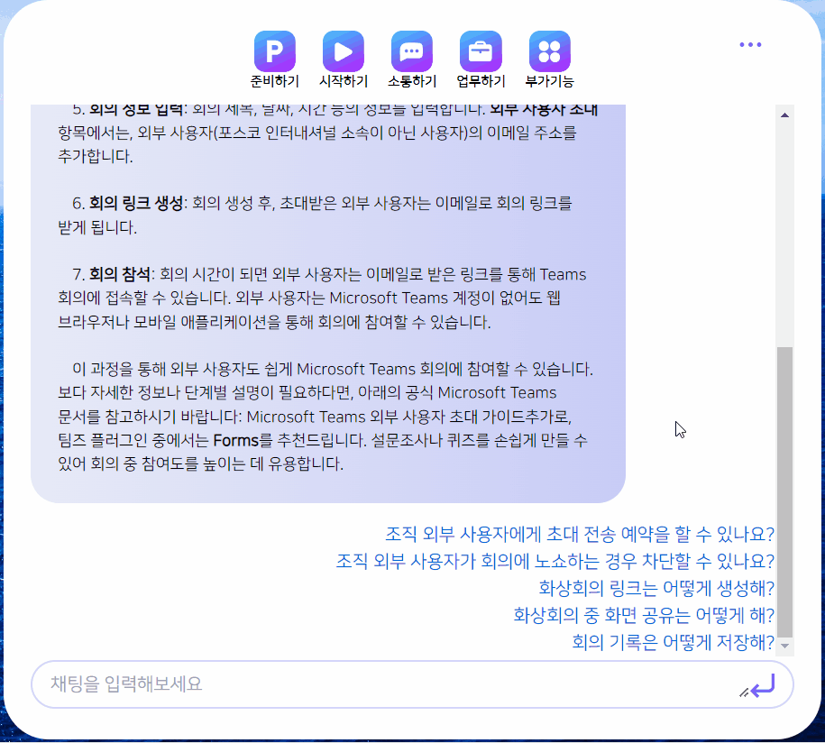
<br /><br />

### 3. Chatbot 응답 중지 기능
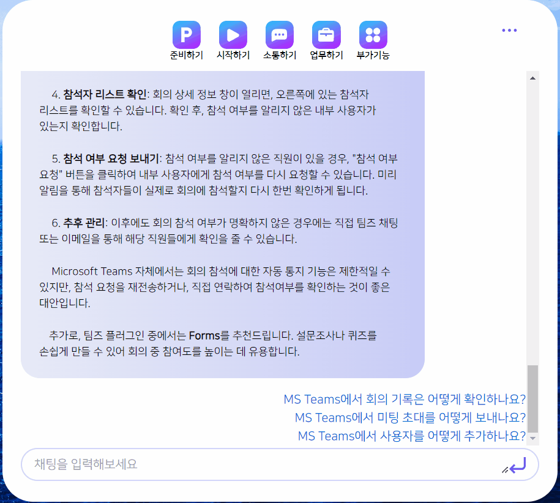
<br /><br />

### 4. 채팅 새로쓰기 (화면 초기화)
#### 4-1. 분기별 질문 가이드
#### 4-2. 가이드 gif 이미지 추가
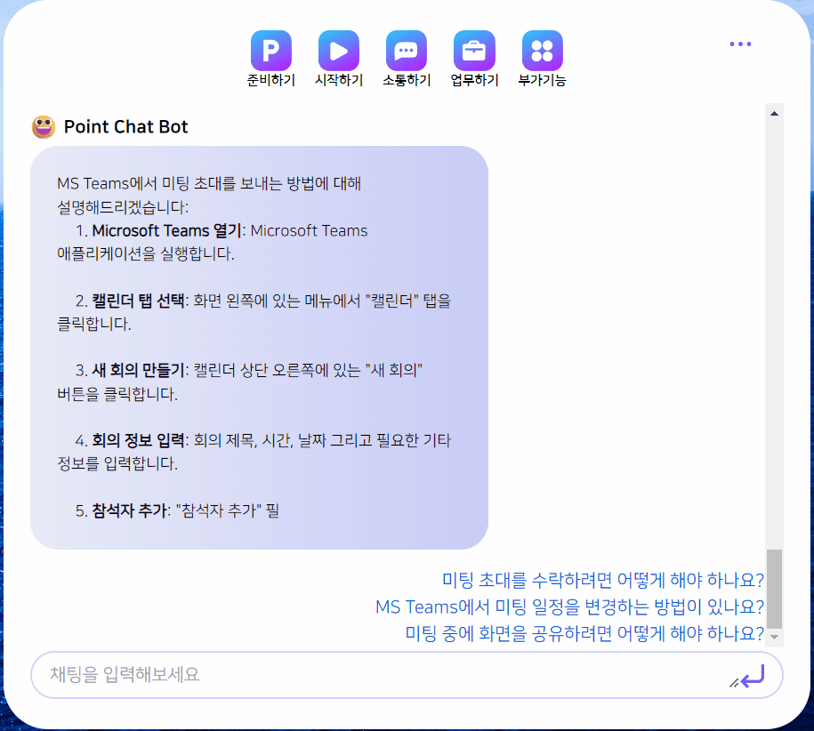
<br /><br />

### 5. 채팅 분류별 저장 기능
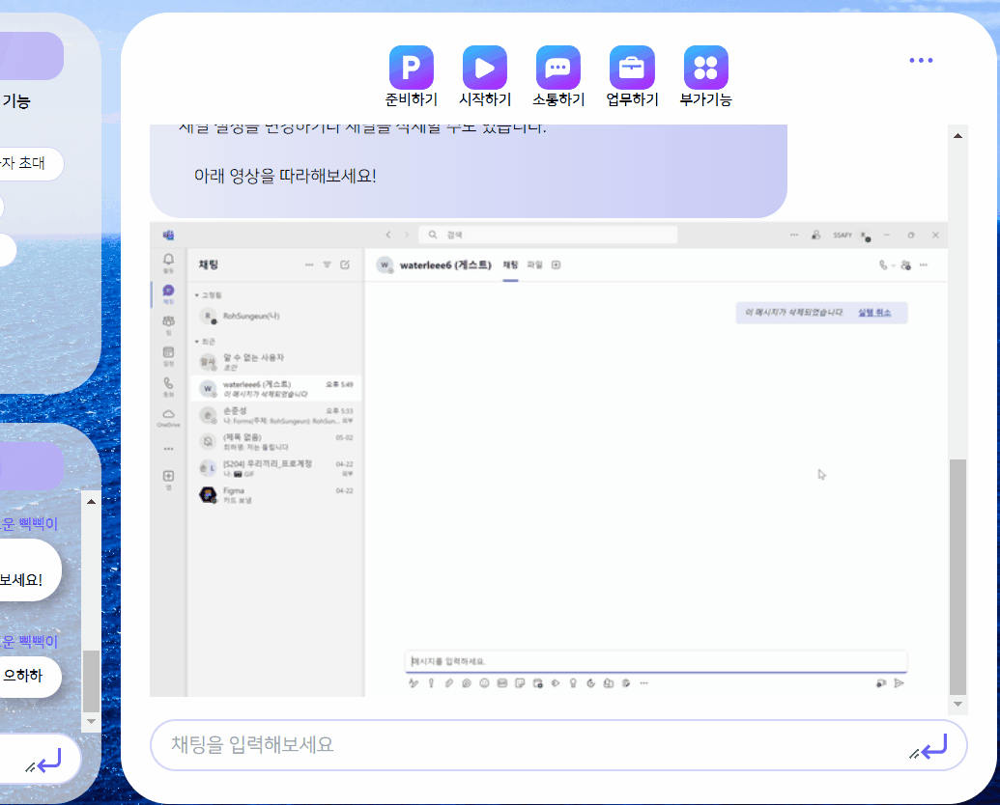
<br /><br />

### 6. 저장 내역 확인
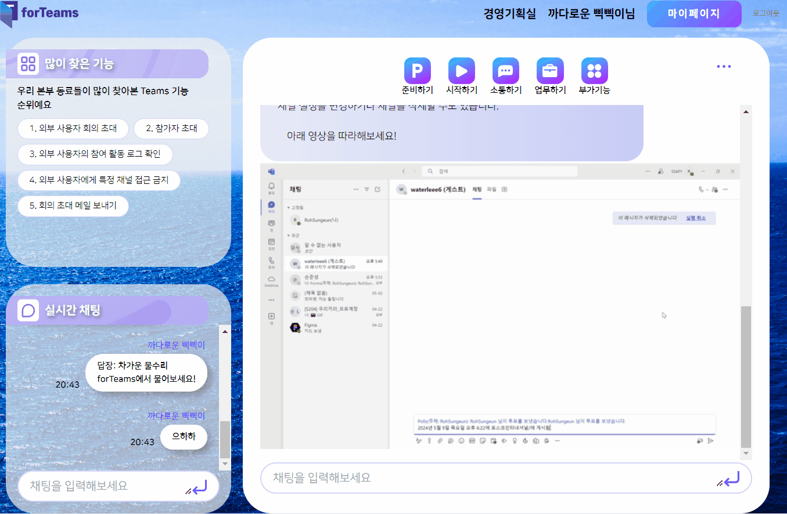
<br /><br />

### 7. 기존 채팅 이어쓰기
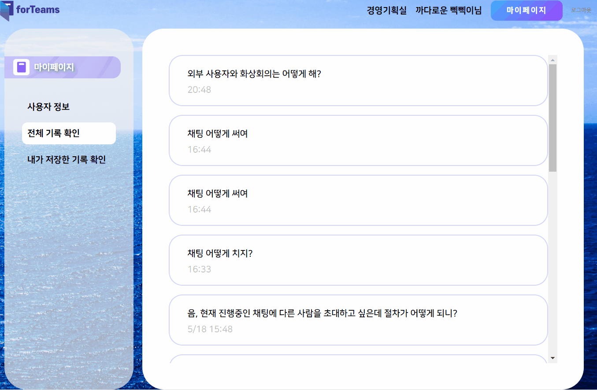
<br /><br />

### 8. 채팅 내역 외부 공유

<br /><br />

### 9. 유용한 플러그인 추천
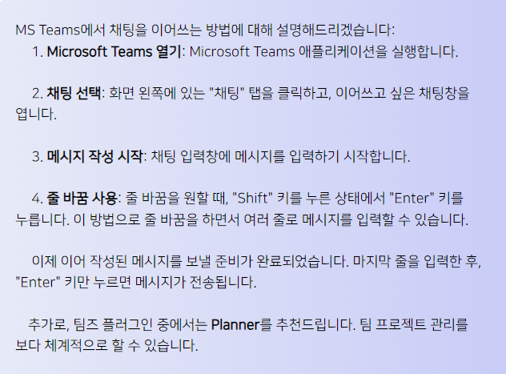
<br /><br />

### 10. 로그 기반 부서별 많이 찾은 기능
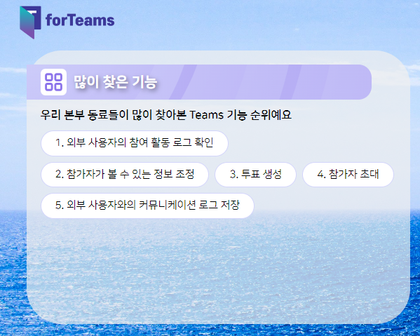
<br /><br />

### 11. 익명 오픈 채팅 (유저 간 자유 질문 + 대나무숲)
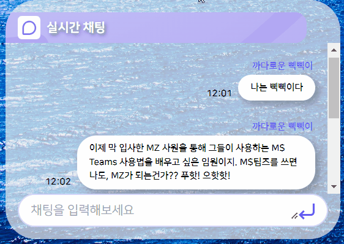
<br /><br />

## 기술 상세
### LangChain 서버 구성 상세

#### 1. 외부(spring boot)로부터 api요청 처리

- 기술: Python
- 기능:
    - 외부로부터 요청을 받는다. (질문 내용)
    - 질문과 응답 내역을 저장한다.
    - 2번 서비스를 통해서 추천질문을 띄워준다.

#### 2. **질문 추천 로직**

- **기술**: Python
- **기능**:
    - **질문 분석**: 사용자의 질문을 분석하여 유사한 질문들을 식별합니다. 이는 자연어 처리 기술을 기반으로 하며, TF-IDF, 벡터화, 클러스터링 등의 방법을 사용합니다.
    - **추천 질문 도출**: 분석된 데이터를 바탕으로 관련 질문을 추천합니다. 이 과정에서 사용자의 이전 질문, 클릭률, 사용자 반응 등을 고려하여 최적의 질문을 선택합니다.

#### **3. 질문 내역 저장**

- **기술**: SQLite
- **기능**:
    - **질문 저장**: 사용자로부터 입력받은 모든 질문을 저장하여 데이터 분석 및 추후 처리를 위한 참조 자료로 활용합니다.
    - **채팅 기록 저장**: 사용자와의 상호작용을 로그로 저장하여, 사용자 경험 개선 및 서비스 분석에 사용합니다.
    - **추천 데이터 관리**: 사용자의 반응 및 클릭 데이터를 기반으로 한 추천 시스템의 입력 데이터를 관리합니다.
    
### 차별점

# 시스템 아키텍처
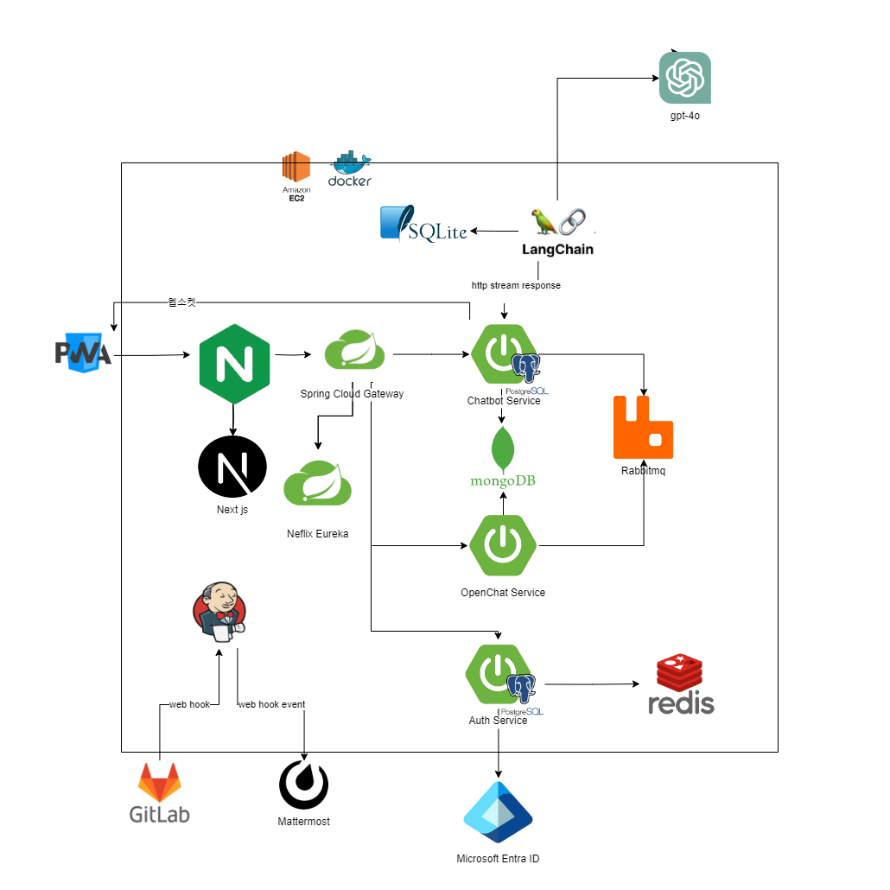
<br /><br />

# Figma
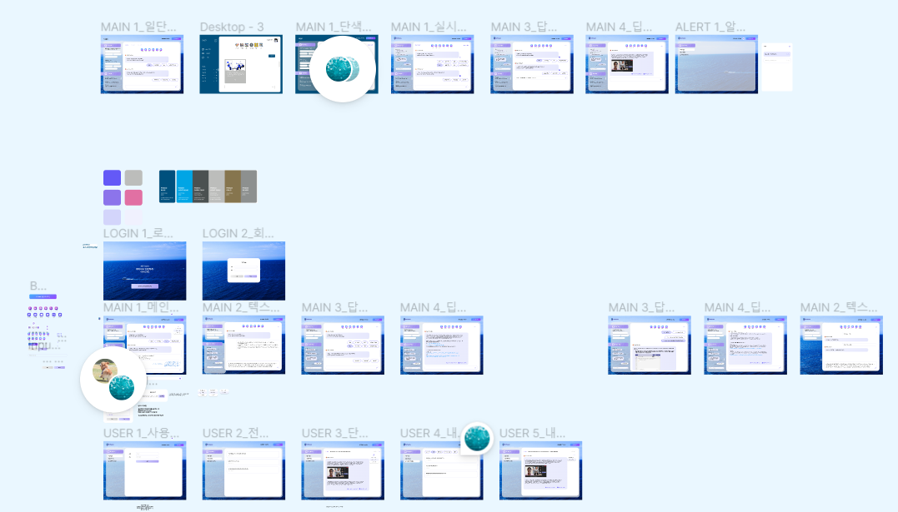
<br /><br />

# ERD
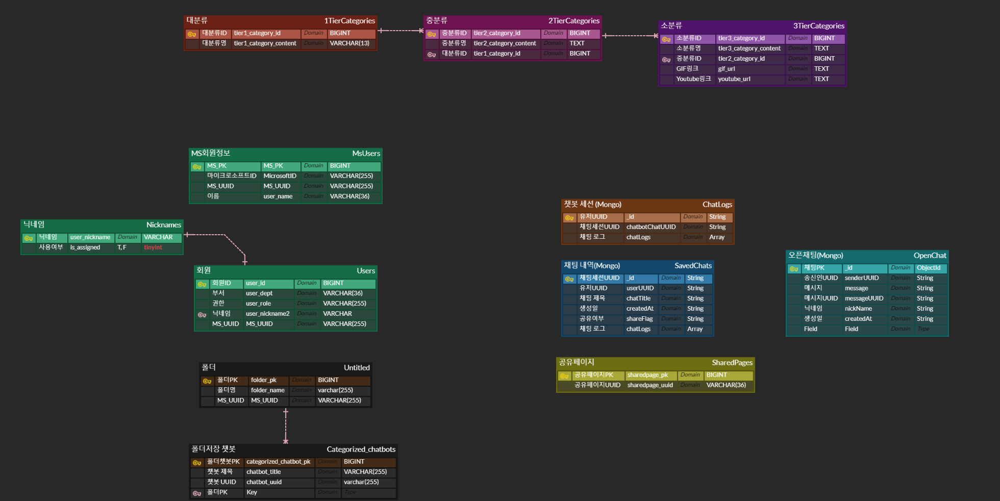
<br /><br />

# 디렉토리 구조
## Front
```
📦FE
 ┗ 📂app
 ┃ ┣ 📂apis
 ┃ ┃ ┣ 📜allLog.js
 ┃ ┃ ┣ 📜chat.js
 ┃ ┃ ┣ 📜chatbot.js
 ┃ ┃ ┣ 📜login.js
 ┃ ┃ ┣ 📜recoFunc.js
 ┃ ┃ ┣ 📜save.js
 ┃ ┃ ┗ 📜share.js
 ┃ ┣ 📂app
 ┃ ┃ ┣ 📂(furcating)
 ┃ ┃ ┃ ┗ 📜page.jsx
 ┃ ┃ ┣ 📂login
 ┃ ┃ ┃ ┗ 📜page.jsx
 ┃ ┃ ┣ 📂logininfo
 ┃ ┃ ┃ ┗ 📜page.jsx
 ┃ ┃ ┣ 📂main
 ┃ ┃ ┃ ┗ 📜page.jsx
 ┃ ┃ ┣ 📂mypage
 ┃ ┃ ┃ ┗ 📜page.jsx
 ┃ ┃ ┣ 📂share
 ┃ ┃ ┃ ┗ 📂[id]
 ┃ ┃ ┃ ┃ ┗ 📜page.jsx
 ┃ ┃ ┗ 📜layout.js
 ┃ ┣ 📂AppImages
 ┃ ┃ ┣ 📂...
 ┃ ┃ ┃ ┣ ...
 ┃ ┃ ┗ 📜icons.json
 ┃ ┣ 📂component
 ┃ ┃ ┣ 📜bigIndex.jsx
 ┃ ┃ ┣ 📜chatbotBubble.jsx
 ┃ ┃ ┣ 📜chatBotInput.jsx
 ┃ ┃ ┣ 📜chattingBubble.jsx
 ┃ ┃ ┣ 📜dropdownInput.jsx
 ┃ ┃ ┣ 📜folderIndex.jsx
 ┃ ┃ ┣ 📜gradientButton.jsx
 ┃ ┃ ┣ 📜hamburgerTitle.jsx
 ┃ ┃ ┣ 📜historyList.jsx
 ┃ ┃ ┣ 📜historyTitle.jsx
 ┃ ┃ ┣ 📜input.jsx
 ┃ ┃ ┣ 📜loginDropdownInput.jsx
 ┃ ┃ ┣ 📜menuBar.jsx
 ┃ ┃ ┣ 📜modalSave.jsx
 ┃ ┃ ┣ 📜modalShare.jsx
 ┃ ┃ ┣ 📜mypageHamburgerMobile.jsx
 ┃ ┃ ┣ 📜mypageHamburgerWeb.jsx
 ┃ ┃ ┣ 📜recoQuestions.jsx
 ┃ ┃ ┣ 📜smallIndex.jsx
 ┃ ┃ ┣ 📜threedotDropdown.jsx
 ┃ ┃ ┣ 📜toTeamsLink.jsx
 ┃ ┃ ┗ 📜toYoutubeLink.jsx
 ┃ ┣ 📂public
 ┃ ┃ ┣ 📂font
 ┃ ┃ ┃ ┣ 📜NanumSquare.ttf
 ┃ ┃ ┃ ┣ 📜NanumSquareB.ttf
 ┃ ┃ ┃ ┣ 📜NanumSquareEB.ttf
 ┃ ┃ ┃ ┣ 📜NanumSquareL.ttf
 ┃ ┃ ┃ ┣ 📜NanumSquareR.ttf
 ┃ ┃ ┃ ┗ 📜YEONGJUSeonbi.ttf
 ┃ ┃ ┣ 📂icon
 ┃ ┃ ┃ ┣ 📜backArrow.svg
 ┃ ┃ ┃ ┣ 📜bigIndexCommunicate.svg
 ┃ ┃ ┃ ┣ 📜bigIndexExtra.svg
 ┃ ┃ ┃ ┣ 📜bigIndexPrepare.svg
 ┃ ┃ ┃ ┣ 📜bigIndexStart.svg
 ┃ ┃ ┃ ┣ 📜bigIndexWork.svg
 ┃ ┃ ┃ ┣ 📜chatting.svg
 ┃ ┃ ┃ ┣ 📜chattingReply.svg
 ┃ ┃ ┃ ┣ 📜dropdown.svg
 ┃ ┃ ┃ ┣ 📜dropdownClose.svg
 ┃ ┃ ┃ ┣ 📜enter.svg
 ┃ ┃ ┃ ┣ 📜forTeams.svg
 ┃ ┃ ┃ ┣ 📜forTeamsLogoOnly.svg
 ┃ ┃ ┃ ┣ 📜mypage.svg
 ┃ ┃ ┃ ┣ 📜myPageButton.svg
 ┃ ┃ ┃ ┣ 📜plus.svg
 ┃ ┃ ┃ ┣ 📜reco.svg
 ┃ ┃ ┃ ┣ 📜rewrite.svg
 ┃ ┃ ┃ ┣ 📜smile.svg
 ┃ ┃ ┃ ┣ 📜stop.svg
 ┃ ┃ ┃ ┣ 📜teams.svg
 ┃ ┃ ┃ ┣ 📜threeDot.svg
 ┃ ┃ ┃ ┣ 📜threeReset.svg
 ┃ ┃ ┃ ┣ 📜threeSave.svg
 ┃ ┃ ┃ ┣ 📜threeShare.svg
 ┃ ┃ ┃ ┣ 📜threeTrash.svg
 ┃ ┃ ┃ ┗ 📜youtube.svg
 ┃ ┃ ┣ 📂image
 ┃ ┃ ┃ ┣ 📜background.mp4
 ┃ ┃ ┃ ┗ 📜mainImage.jpg
 ┃ ┃ ┣ 📂util
 ┃ ┃ ┃ ┣ 📜baseAPI.jsx
 ┃ ┃ ┃ ┣ 📜getDate.jsx
 ┃ ┃ ┃ ┣ 📜getToken.jsx
 ┃ ┃ ┃ ┣ 📜getWindowSize.jsx
 ┃ ┃ ┃ ┣ 📜localStorage.jsx
 ┃ ┃ ┃ ┗ 📜recoilRootProvider.jsx
 ┃ ┃ ┣ 📜sw.js
 ┃ ┃ ┣ 📜sw.js.map
 ┃ ┃ ┣ 📜workbox-e43f5367.js
 ┃ ┃ ┗ 📜workbox-e43f5367.js.map
 ┃ ┣ 📂styles
 ┃ ┃ ┣ 📂component
 ┃ ┃ ┃ ┣ 📜bigIndex.module.css
 ┃ ┃ ┃ ┣ 📜chatBotBubble.module.css
 ┃ ┃ ┃ ┣ 📜chatBotInput.module.css
 ┃ ┃ ┃ ┣ 📜chattingBubble.module.css
 ┃ ┃ ┃ ┣ 📜dropdownInput.module.css
 ┃ ┃ ┃ ┣ 📜folderIndex.module.css
 ┃ ┃ ┃ ┣ 📜gradientButton.module.css
 ┃ ┃ ┃ ┣ 📜hamburgerTitle.module.css
 ┃ ┃ ┃ ┣ 📜historyList.module.css
 ┃ ┃ ┃ ┣ 📜historyTitle.module.css
 ┃ ┃ ┃ ┣ 📜input.module.css
 ┃ ┃ ┃ ┣ 📜loginDropdownInput.module.css
 ┃ ┃ ┃ ┣ 📜menuBar.module.css
 ┃ ┃ ┃ ┣ 📜modalSave.module.css
 ┃ ┃ ┃ ┣ 📜modalShare.module.css
 ┃ ┃ ┃ ┣ 📜mypageHamburgerMobile.module.css
 ┃ ┃ ┃ ┣ 📜mypageHamburgerWeb.module.css
 ┃ ┃ ┃ ┣ 📜recoQuestions.module.css
 ┃ ┃ ┃ ┣ 📜smallIndex.module.css
 ┃ ┃ ┃ ┣ 📜threedotDropdown.module.css
 ┃ ┃ ┃ ┣ 📜toTeamsLink.module.css
 ┃ ┃ ┃ ┗ 📜toYoutubeLink.module.css
 ┃ ┃ ┣ 📂page
 ┃ ┃ ┃ ┣ 📜layoutContent.module.css
 ┃ ┃ ┃ ┣ 📜login.module.css
 ┃ ┃ ┃ ┣ 📜loginInfo.module.css
 ┃ ┃ ┃ ┣ 📜main.module.css
 ┃ ┃ ┃ ┣ 📜mypage.module.css
 ┃ ┃ ┃ ┗ 📜share.module.css
 ┃ ┃ ┣ 📂template
 ┃ ┃ ┃ ┣ 📜chatBotMain.module.css
 ┃ ┃ ┃ ┣ 📜chatMain.module.css
 ┃ ┃ ┃ ┣ 📜mainSwiper.module.css
 ┃ ┃ ┃ ┣ 📜mypageAllLogs.module.css
 ┃ ┃ ┃ ┣ 📜mypageAllLogsDetail.module.css
 ┃ ┃ ┃ ┣ 📜mypageInfo.module.css
 ┃ ┃ ┃ ┣ 📜mypageMyLogs.module.css
 ┃ ┃ ┃ ┣ 📜mypageMyLogsDetail.module.css
 ┃ ┃ ┃ ┗ 📜RecoFunctionMain.module.css
 ┃ ┃ ┗ 📜globals.css
 ┃ ┣ 📂template
 ┃ ┃ ┣ 📂chat
 ┃ ┃ ┃ ┗ 📜chatMain.jsx
 ┃ ┃ ┣ 📂chatBot
 ┃ ┃ ┃ ┗ 📜chatBotMain.jsx
 ┃ ┃ ┣ 📂main
 ┃ ┃ ┃ ┗ 📜mainSwiper.jsx
 ┃ ┃ ┣ 📂mypage
 ┃ ┃ ┃ ┣ 📜mypageAllLogs.jsx
 ┃ ┃ ┃ ┣ 📜mypageAllLogsDetail.jsx
 ┃ ┃ ┃ ┣ 📜mypageInfo.jsx
 ┃ ┃ ┃ ┣ 📜mypageMyLogs.jsx
 ┃ ┃ ┃ ┗ 📜mypageMyLogsDetail.jsx
 ┃ ┃ ┗ 📂recoFunction
 ┃ ┃ ┃ ┗ 📜recoFunctionMain.jsx
 ┃ ┣ 📜.eslintrc.json
 ┃ ┣ 📜.gitignore
 ┃ ┣ 📜.prettierrc.js
 ┃ ┣ 📜Dockerfile
 ┃ ┣ 📜jsconfig.json
 ┃ ┣ 📜manifest.json
 ┃ ┣ 📜middleware.js
 ┃ ┣ 📜next.config.js
 ┃ ┣ 📜offline.html
 ┃ ┣ 📜package-lock.json
 ┃ ┣ 📜package.json
 ┃ ┣ 📜postcss.config.mjs
 ┃ ┣ 📜pwabuilder-sw.js
 ┃ ┣ 📜README.md
 ┃ ┗ 📜tailwind.config.js
```
## Back
```
📦BE
 ┣ 📂auth
 ┃ ┣ 📂gradle
 ┃ ┃ ┗ 📂wrapper
 ┃ ┃ ┃ ┣ 📜gradle-wrapper.jar
 ┃ ┃ ┃ ┗ 📜gradle-wrapper.properties
 ┃ ┣ 📂src
 ┃ ┃ ┣ 📂main
 ┃ ┃ ┃ ┣ 📂java
 ┃ ┃ ┃ ┃ ┗ 📂com
 ┃ ┃ ┃ ┃ ┃ ┗ 📂forteams
 ┃ ┃ ┃ ┃ ┃ ┃ ┗ 📂auth
 ┃ ┃ ┃ ┃ ┃ ┃ ┃ ┣ 📂config
 ┃ ┃ ┃ ┃ ┃ ┃ ┃ ┃ ┣ 📜JasyptConfig.java
 ┃ ┃ ┃ ┃ ┃ ┃ ┃ ┃ ┣ 📜NicknameLoader.java
 ┃ ┃ ┃ ┃ ┃ ┃ ┃ ┃ ┣ 📜OAuth2Config.java
 ┃ ┃ ┃ ┃ ┃ ┃ ┃ ┃ ┣ 📜RedisConfig.java
 ┃ ┃ ┃ ┃ ┃ ┃ ┃ ┃ ┗ 📜WebSecurityConfig.java
 ┃ ┃ ┃ ┃ ┃ ┃ ┃ ┣ 📂controller
 ┃ ┃ ┃ ┃ ┃ ┃ ┃ ┃ ┣ 📜AuthController.java
 ┃ ┃ ┃ ┃ ┃ ┃ ┃ ┃ ┗ 📜UserController.java
 ┃ ┃ ┃ ┃ ┃ ┃ ┃ ┣ 📂entity
 ┃ ┃ ┃ ┃ ┃ ┃ ┃ ┃ ┣ 📜CustomOidcUser.java
 ┃ ┃ ┃ ┃ ┃ ┃ ┃ ┃ ┣ 📜MsUserEntity.java
 ┃ ┃ ┃ ┃ ┃ ┃ ┃ ┃ ┣ 📜NicknameEntity.java
 ┃ ┃ ┃ ┃ ┃ ┃ ┃ ┃ ┗ 📜UserEntity.java
 ┃ ┃ ┃ ┃ ┃ ┃ ┃ ┣ 📂filter
 ┃ ┃ ┃ ┃ ┃ ┃ ┃ ┃ ┗ 📜JwtAuthenticationFilter.java
 ┃ ┃ ┃ ┃ ┃ ┃ ┃ ┣ 📂handler
 ┃ ┃ ┃ ┃ ┃ ┃ ┃ ┃ ┣ 📜OAuth2FailureHandler.java
 ┃ ┃ ┃ ┃ ┃ ┃ ┃ ┃ ┗ 📜OAuth2SuccessHandler.java
 ┃ ┃ ┃ ┃ ┃ ┃ ┃ ┣ 📂provider
 ┃ ┃ ┃ ┃ ┃ ┃ ┃ ┃ ┣ 📜JwtInCookieRedis.java
 ┃ ┃ ┃ ┃ ┃ ┃ ┃ ┃ ┗ 📜JwtProvider.java
 ┃ ┃ ┃ ┃ ┃ ┃ ┃ ┣ 📂repository
 ┃ ┃ ┃ ┃ ┃ ┃ ┃ ┃ ┣ 📜MsUserRepository.java
 ┃ ┃ ┃ ┃ ┃ ┃ ┃ ┃ ┣ 📜NicknameRepository.java
 ┃ ┃ ┃ ┃ ┃ ┃ ┃ ┃ ┗ 📜UserRepository.java
 ┃ ┃ ┃ ┃ ┃ ┃ ┃ ┣ 📂service
 ┃ ┃ ┃ ┃ ┃ ┃ ┃ ┃ ┣ 📂nickname
 ┃ ┃ ┃ ┃ ┃ ┃ ┃ ┃ ┃ ┣ 📜NicknameService.java
 ┃ ┃ ┃ ┃ ┃ ┃ ┃ ┃ ┃ ┗ 📜NicknameServiceImpl.java
 ┃ ┃ ┃ ┃ ┃ ┃ ┃ ┃ ┣ 📂token
 ┃ ┃ ┃ ┃ ┃ ┃ ┃ ┃ ┃ ┣ 📜CustomTokenService.java
 ┃ ┃ ┃ ┃ ┃ ┃ ┃ ┃ ┃ ┣ 📜CustomTokenServiceImpl.java
 ┃ ┃ ┃ ┃ ┃ ┃ ┃ ┃ ┃ ┣ 📜RedisService.java
 ┃ ┃ ┃ ┃ ┃ ┃ ┃ ┃ ┃ ┗ 📜RedisServiceImpl.java
 ┃ ┃ ┃ ┃ ┃ ┃ ┃ ┃ ┣ 📜AuthService.java
 ┃ ┃ ┃ ┃ ┃ ┃ ┃ ┃ ┣ 📜AuthServiceImpl.java
 ┃ ┃ ┃ ┃ ┃ ┃ ┃ ┃ ┗ 📜CustomOidcUserServiceImpl.java
 ┃ ┃ ┃ ┃ ┃ ┃ ┃ ┗ 📜AuthApplication.java
 ┃ ┃ ┃ ┗ 📂resources
 ┃ ┃ ┃ ┃ ┣ 📂templates
 ┃ ┃ ┃ ┃ ┃ ┣ 📜auth_page.html
 ┃ ┃ ┃ ┃ ┃ ┣ 📜error.html
 ┃ ┃ ┃ ┃ ┃ ┗ 📜welcome.html
 ┃ ┃ ┃ ┃ ┗ 📜application.yml
 ┃ ┃ ┗ 📂test
 ┃ ┃ ┃ ┗ ...
 ┃ ┣ 📜.gitignore
 ┃ ┣ 📜build.gradle
 ┃ ┣ 📜Dockerfile
 ┃ ┣ 📜gradlew
 ┃ ┣ 📜gradlew.bat
 ┃ ┗ 📜settings.gradle
 ┣ 📂chatbot
 ┃ ┣ 📂gradle
 ┃ ┃ ┗ 📂wrapper
 ┃ ┃ ┃ ┣ 📜gradle-wrapper.jar
 ┃ ┃ ┃ ┗ 📜gradle-wrapper.properties
 ┃ ┣ 📂src
 ┃ ┃ ┣ 📂main
 ┃ ┃ ┃ ┣ 📂java
 ┃ ┃ ┃ ┃ ┗ 📂com
 ┃ ┃ ┃ ┃ ┃ ┗ 📂forteams
 ┃ ┃ ┃ ┃ ┃ ┃ ┗ 📂chatbot
 ┃ ┃ ┃ ┃ ┃ ┃ ┃ ┣ 📂chat
 ┃ ┃ ┃ ┃ ┃ ┃ ┃ ┃ ┣ 📂controller
 ┃ ┃ ┃ ┃ ┃ ┃ ┃ ┃ ┃ ┗ 📜ChatbotController.java
 ┃ ┃ ┃ ┃ ┃ ┃ ┃ ┃ ┣ 📂dto
 ┃ ┃ ┃ ┃ ┃ ┃ ┃ ┃ ┃ ┣ 📜ChatbotDto.java
 ┃ ┃ ┃ ┃ ┃ ┃ ┃ ┃ ┃ ┣ 📜ChatbotSaveResponseDto.java
 ┃ ┃ ┃ ┃ ┃ ┃ ┃ ┃ ┃ ┣ 📜ChatbotSessionUUIDDto.java
 ┃ ┃ ┃ ┃ ┃ ┃ ┃ ┃ ┃ ┣ 📜ChatLogDto.java
 ┃ ┃ ┃ ┃ ┃ ┃ ┃ ┃ ┃ ┣ 📜Message.java
 ┃ ┃ ┃ ┃ ┃ ┃ ┃ ┃ ┃ ┣ 📜MessageRequest.java
 ┃ ┃ ┃ ┃ ┃ ┃ ┃ ┃ ┃ ┣ 📜MessageUser.java
 ┃ ┃ ┃ ┃ ┃ ┃ ┃ ┃ ┃ ┣ 📜SaveChatRequest.java
 ┃ ┃ ┃ ┃ ┃ ┃ ┃ ┃ ┃ ┗ 📜UserAllChatListDto.java
 ┃ ┃ ┃ ┃ ┃ ┃ ┃ ┃ ┣ 📂entity
 ┃ ┃ ┃ ┃ ┃ ┃ ┃ ┃ ┃ ┣ 📜ChatbotLogSet.java
 ┃ ┃ ┃ ┃ ┃ ┃ ┃ ┃ ┃ ┗ 📜SavedChatLogSet.java
 ┃ ┃ ┃ ┃ ┃ ┃ ┃ ┃ ┣ 📂interceptor
 ┃ ┃ ┃ ┃ ┃ ┃ ┃ ┃ ┃ ┗ 📜CustomHandshakeInterceptor.java
 ┃ ┃ ┃ ┃ ┃ ┃ ┃ ┃ ┣ 📂repository
 ┃ ┃ ┃ ┃ ┃ ┃ ┃ ┃ ┃ ┣ 📜ChatbotLogSetRepository.java
 ┃ ┃ ┃ ┃ ┃ ┃ ┃ ┃ ┃ ┣ 📜ChatbotRepository.java
 ┃ ┃ ┃ ┃ ┃ ┃ ┃ ┃ ┃ ┗ 📜SavedChatLogSetRepository.java
 ┃ ┃ ┃ ┃ ┃ ┃ ┃ ┃ ┗ 📂service
 ┃ ┃ ┃ ┃ ┃ ┃ ┃ ┃ ┃ ┣ 📜ChatbotService.java
 ┃ ┃ ┃ ┃ ┃ ┃ ┃ ┃ ┃ ┣ 📜StreamStatusService.java
 ┃ ┃ ┃ ┃ ┃ ┃ ┃ ┃ ┃ ┗ 📜TokenService.java
 ┃ ┃ ┃ ┃ ┃ ┃ ┃ ┣ 📂common
 ┃ ┃ ┃ ┃ ┃ ┃ ┃ ┃ ┣ 📂config
 ┃ ┃ ┃ ┃ ┃ ┃ ┃ ┃ ┃ ┣ 📜AppConfig.java
 ┃ ┃ ┃ ┃ ┃ ┃ ┃ ┃ ┃ ┣ 📜JacksonConfig.java
 ┃ ┃ ┃ ┃ ┃ ┃ ┃ ┃ ┃ ┣ 📜JasyptConfig.java
 ┃ ┃ ┃ ┃ ┃ ┃ ┃ ┃ ┃ ┣ 📜MongoConfig.java
 ┃ ┃ ┃ ┃ ┃ ┃ ┃ ┃ ┃ ┣ 📜RabbitConfig.java
 ┃ ┃ ┃ ┃ ┃ ┃ ┃ ┃ ┃ ┣ 📜RedisConfig.java
 ┃ ┃ ┃ ┃ ┃ ┃ ┃ ┃ ┃ ┣ 📜SchedulingConfig.java
 ┃ ┃ ┃ ┃ ┃ ┃ ┃ ┃ ┃ ┣ 📜SecurityConfig.java
 ┃ ┃ ┃ ┃ ┃ ┃ ┃ ┃ ┃ ┗ 📜WebSocketConfig.java
 ┃ ┃ ┃ ┃ ┃ ┃ ┃ ┃ ┣ 📜BaseEntity.java
 ┃ ┃ ┃ ┃ ┃ ┃ ┃ ┃ ┗ 📜ChatbotBaseEntity.java
 ┃ ┃ ┃ ┃ ┃ ┃ ┃ ┣ 📂folder
 ┃ ┃ ┃ ┃ ┃ ┃ ┃ ┃ ┣ 📂controller
 ┃ ┃ ┃ ┃ ┃ ┃ ┃ ┃ ┃ ┣ 📜FolderController.java
 ┃ ┃ ┃ ┃ ┃ ┃ ┃ ┃ ┃ ┗ 📜TokenTestController.java
 ┃ ┃ ┃ ┃ ┃ ┃ ┃ ┃ ┣ 📂dto
 ┃ ┃ ┃ ┃ ┃ ┃ ┃ ┃ ┃ ┣ 📜CategorizedChatbotRegisterDto.java
 ┃ ┃ ┃ ┃ ┃ ┃ ┃ ┃ ┃ ┣ 📜CategorizedChatbotResponseDto.java
 ┃ ┃ ┃ ┃ ┃ ┃ ┃ ┃ ┃ ┣ 📜FolderListFetchDto.java
 ┃ ┃ ┃ ┃ ┃ ┃ ┃ ┃ ┃ ┣ 📜FolderRegisterDto.java
 ┃ ┃ ┃ ┃ ┃ ┃ ┃ ┃ ┃ ┣ 📜FolderResponseDto.java
 ┃ ┃ ┃ ┃ ┃ ┃ ┃ ┃ ┃ ┗ 📜FolderUpdateDto.java
 ┃ ┃ ┃ ┃ ┃ ┃ ┃ ┃ ┣ 📂entity
 ┃ ┃ ┃ ┃ ┃ ┃ ┃ ┃ ┃ ┣ 📜CategorizedChatbot.java
 ┃ ┃ ┃ ┃ ┃ ┃ ┃ ┃ ┃ ┗ 📜Folder.java
 ┃ ┃ ┃ ┃ ┃ ┃ ┃ ┃ ┣ 📂repository
 ┃ ┃ ┃ ┃ ┃ ┃ ┃ ┃ ┃ ┣ 📜CategorizedChatbotRepository.java
 ┃ ┃ ┃ ┃ ┃ ┃ ┃ ┃ ┃ ┗ 📜FolderRepository.java
 ┃ ┃ ┃ ┃ ┃ ┃ ┃ ┃ ┗ 📂service
 ┃ ┃ ┃ ┃ ┃ ┃ ┃ ┃ ┃ ┗ 📜FolderService.java
 ┃ ┃ ┃ ┃ ┃ ┃ ┃ ┣ 📂user
 ┃ ┃ ┃ ┃ ┃ ┃ ┃ ┃ ┣ 📂entity
 ┃ ┃ ┃ ┃ ┃ ┃ ┃ ┃ ┃ ┗ 📜User.java
 ┃ ┃ ┃ ┃ ┃ ┃ ┃ ┃ ┗ 📂repository
 ┃ ┃ ┃ ┃ ┃ ┃ ┃ ┃ ┃ ┗ 📜UserRepository.java
 ┃ ┃ ┃ ┃ ┃ ┃ ┃ ┗ 📜ChatbotApplication.java
 ┃ ┃ ┃ ┗ 📂resources
 ┃ ┃ ┃ ┃ ┣ 📜application-secret.yml
 ┃ ┃ ┃ ┃ ┗ 📜application.yml
 ┃ ┃ ┗ 📂test
 ┃ ┃ ┃ ┗ ...
 ┃ ┣ 📜.gitignore
 ┃ ┣ 📜build.gradle
 ┃ ┣ 📜Dockerfile
 ┃ ┣ 📜gradlew
 ┃ ┣ 📜gradlew.bat
 ┃ ┗ 📜settings.gradle
 ┣ 📂discovery
 ┃ ┣ 📂gradle
 ┃ ┃ ┗ 📂wrapper
 ┃ ┃ ┃ ┣ 📜gradle-wrapper.jar
 ┃ ┃ ┃ ┗ 📜gradle-wrapper.properties
 ┃ ┣ 📂src
 ┃ ┃ ┣ 📂main
 ┃ ┃ ┃ ┣ 📂java
 ┃ ┃ ┃ ┃ ┗ 📂com
 ┃ ┃ ┃ ┃ ┃ ┗ 📂forteams
 ┃ ┃ ┃ ┃ ┃ ┃ ┗ 📂discovery
 ┃ ┃ ┃ ┃ ┃ ┃ ┃ ┗ 📜DiscoveryApplication.java
 ┃ ┃ ┃ ┗ 📂resources
 ┃ ┃ ┃ ┃ ┗ 📜application.yml
 ┃ ┃ ┗ 📂test
 ┃ ┃ ┃ ┗ 📂...
 ┃ ┣ 📜.gitignore
 ┃ ┣ 📜build.gradle
 ┃ ┣ 📜Dockerfile
 ┃ ┣ 📜gradlew
 ┃ ┣ 📜gradlew.bat
 ┃ ┗ 📜settings.gradle
 ┣ 📂gateway
 ┃ ┣ 📂gradle
 ┃ ┃ ┗ 📂wrapper
 ┃ ┃ ┃ ┣ 📜gradle-wrapper.jar
 ┃ ┃ ┃ ┗ 📜gradle-wrapper.properties
 ┃ ┣ 📂src
 ┃ ┃ ┣ 📂main
 ┃ ┃ ┃ ┣ 📂java
 ┃ ┃ ┃ ┃ ┗ 📂com
 ┃ ┃ ┃ ┃ ┃ ┗ 📂forteams
 ┃ ┃ ┃ ┃ ┃ ┃ ┗ 📂gateway
 ┃ ┃ ┃ ┃ ┃ ┃ ┃ ┣ 📂config
 ┃ ┃ ┃ ┃ ┃ ┃ ┃ ┃ ┣ 📜JwtTokenFilter.java
 ┃ ┃ ┃ ┃ ┃ ┃ ┃ ┃ ┣ 📜SecurityConfig.java
 ┃ ┃ ┃ ┃ ┃ ┃ ┃ ┃ ┗ 📜WebFluxConfig.java
 ┃ ┃ ┃ ┃ ┃ ┃ ┃ ┣ 📂service
 ┃ ┃ ┃ ┃ ┃ ┃ ┃ ┃ ┗ 📜TokenService.java
 ┃ ┃ ┃ ┃ ┃ ┃ ┃ ┣ 📜GatewayApplication.java
 ┃ ┃ ┃ ┃ ┃ ┃ ┃ ┗ 📜HeaderDto.java
 ┃ ┃ ┃ ┗ 📂resources
 ┃ ┃ ┃ ┃ ┗ 📜application.yml
 ┃ ┃ ┗ 📂test
 ┃ ┃ ┃ ┗ 📂...
 ┃ ┣ 📜.gitignore
 ┃ ┣ 📜build.gradle
 ┃ ┣ 📜Dockerfile
 ┃ ┣ 📜gradlew
 ┃ ┣ 📜gradlew.bat
 ┃ ┗ 📜settings.gradle
 ┣ 📂openchat
 ┃ ┣ 📂gradle
 ┃ ┃ ┗ 📂wrapper
 ┃ ┃ ┃ ┣ 📜gradle-wrapper.jar
 ┃ ┃ ┃ ┗ 📜gradle-wrapper.properties
 ┃ ┣ 📂src
 ┃ ┃ ┣ 📂main
 ┃ ┃ ┃ ┣ 📂java
 ┃ ┃ ┃ ┃ ┗ 📂com
 ┃ ┃ ┃ ┃ ┃ ┗ 📂forteams
 ┃ ┃ ┃ ┃ ┃ ┃ ┗ 📂openchat
 ┃ ┃ ┃ ┃ ┃ ┃ ┃ ┣ 📂chat
 ┃ ┃ ┃ ┃ ┃ ┃ ┃ ┃ ┣ 📂controller
 ┃ ┃ ┃ ┃ ┃ ┃ ┃ ┃ ┃ ┗ 📜OpenChatController.java
 ┃ ┃ ┃ ┃ ┃ ┃ ┃ ┃ ┣ 📂dto
 ┃ ┃ ┃ ┃ ┃ ┃ ┃ ┃ ┃ ┗ 📜OpenChatDto.java
 ┃ ┃ ┃ ┃ ┃ ┃ ┃ ┃ ┣ 📂entity
 ┃ ┃ ┃ ┃ ┃ ┃ ┃ ┃ ┃ ┗ 📜OpenChat.java
 ┃ ┃ ┃ ┃ ┃ ┃ ┃ ┃ ┣ 📂repository
 ┃ ┃ ┃ ┃ ┃ ┃ ┃ ┃ ┃ ┗ 📜OpenChatRepository.java
 ┃ ┃ ┃ ┃ ┃ ┃ ┃ ┃ ┗ 📂service
 ┃ ┃ ┃ ┃ ┃ ┃ ┃ ┃ ┃ ┗ 📜OpenChatService.java
 ┃ ┃ ┃ ┃ ┃ ┃ ┃ ┣ 📂common
 ┃ ┃ ┃ ┃ ┃ ┃ ┃ ┃ ┣ 📂config
 ┃ ┃ ┃ ┃ ┃ ┃ ┃ ┃ ┃ ┣ 📜JacksonConfig.java
 ┃ ┃ ┃ ┃ ┃ ┃ ┃ ┃ ┃ ┣ 📜JasyptConfig.java
 ┃ ┃ ┃ ┃ ┃ ┃ ┃ ┃ ┃ ┣ 📜MongoConfig.java
 ┃ ┃ ┃ ┃ ┃ ┃ ┃ ┃ ┃ ┣ 📜RabbitConfig.java
 ┃ ┃ ┃ ┃ ┃ ┃ ┃ ┃ ┃ ┣ 📜RedisConfig.java
 ┃ ┃ ┃ ┃ ┃ ┃ ┃ ┃ ┃ ┣ 📜SchedulingConfig.java
 ┃ ┃ ┃ ┃ ┃ ┃ ┃ ┃ ┃ ┣ 📜SecurityConfig.java
 ┃ ┃ ┃ ┃ ┃ ┃ ┃ ┃ ┃ ┗ 📜WebSocketConfig.java
 ┃ ┃ ┃ ┃ ┃ ┃ ┃ ┃ ┗ 📜BaseEntity.java
 ┃ ┃ ┃ ┃ ┃ ┃ ┃ ┗ 📜OpenchatApplication.java
 ┃ ┃ ┃ ┗ 📂resources
 ┃ ┃ ┃ ┃ ┗ 📜application.yml
 ┃ ┃ ┗ 📂test
 ┃ ┃ ┃ ┗ 📂...
 ┃ ┣ 📜.gitignore
 ┃ ┣ 📜build.gradle
 ┃ ┣ 📜Dockerfile
 ┃ ┣ 📜gradlew
 ┃ ┣ 📜gradlew.bat
 ┃ ┗ 📜settings.gradle
 ┗ 📜.gitkeep
```
## AI
```
📦AI
 ┣ 📂app
 ┃ ┣ 📂bin
 ┃ ┃ ┣ 📜activate
 ┃ ┃ ┣ 📜activate.csh
 ┃ ┃ ┣ 📜activate.fish
 ┃ ┃ ┣ 📜activate.nu
 ┃ ┃ ┣ 📜activate.ps1
 ┃ ┃ ┣ 📜activate_this.py
 ┃ ┃ ┣ 📜deactivate.nu
 ┃ ┃ ┣ 📜distro
 ┃ ┃ ┣ 📜dotenv
 ┃ ┃ ┣ 📜f2py
 ┃ ┃ ┣ 📜f2py3
 ┃ ┃ ┣ 📜f2py3.9
 ┃ ┃ ┣ 📜httpx
 ┃ ┃ ┣ 📜jsondiff
 ┃ ┃ ┣ 📜jsonpatch
 ┃ ┃ ┣ 📜jsonpointer
 ┃ ┃ ┣ 📜langchain-server
 ┃ ┃ ┣ 📜langsmith
 ┃ ┃ ┣ 📜normalizer
 ┃ ┃ ┣ 📜openai
 ┃ ┃ ┣ 📜pip
 ┃ ┃ ┣ 📜pip3
 ┃ ┃ ┣ 📜pip3.10
 ┃ ┃ ┣ 📜pip3.9
 ┃ ┃ ┣ 📜python
 ┃ ┃ ┣ 📜python3
 ┃ ┃ ┣ 📜python3.9
 ┃ ┃ ┣ 📜tqdm
 ┃ ┃ ┣ 📜uvicorn
 ┃ ┃ ┣ 📜watchfiles
 ┃ ┃ ┣ 📜wheel
 ┃ ┃ ┣ 📜wheel-3.9
 ┃ ┃ ┣ 📜wheel3
 ┃ ┃ ┗ 📜wheel3.9
 ┃ ┣ 📂LangchainRepository
 ┃ ┃ ┣ 📂completion
 ┃ ┃ ┃ ┣ 📜requestCompletion.py
 ┃ ┃ ┃ ┗ 📜requestCompletion2.py
 ┃ ┃ ┣ 📂handler
 ┃ ┃ ┃ ┣ 📜messageStreamingHandler.py
 ┃ ┃ ┃ ┗ 📜messageStreamingHandler2.py
 ┃ ┃ ┣ 📂recommandation
 ┃ ┃ ┃ ┗ 📜recommandation.py
 ┃ ┃ ┗ 📂websocket
 ┃ ┃ ┃ ┗ 📜stompClient.py
 ┃ ┣ 📂resources
 ┃ ┃ ┗ 📜embeddings.json
 ┃ ┣ 📜.gitignore
 ┃ ┣ 📜clutering_test.py
 ┃ ┣ 📜Dockerfile
 ┃ ┣ 📜embeddings.json
 ┃ ┣ 📜embeddings_js.json
 ┃ ┣ 📜embeddings_test.json
 ┃ ┣ 📜example.db
 ┃ ┣ 📜example.py
 ┃ ┣ 📜example_copy.db
 ┃ ┣ 📜main.py
 ┃ ┣ 📜pyvenv.cfg
 ┃ ┣ 📜requirements.txt
 ┃ ┣ 📜sqlitedb.py
 ┃ ┣ 📜sqlitedb_copy.py
 ┃ ┣ 📜teams_functions.py
 ┃ ┗ 📜teams_functions_copy.py
 ┣ 📜Dockerfile
 ┣ 📜example.db
 ┗ 📜requirements.txt
```

## Webhook 활용 알림
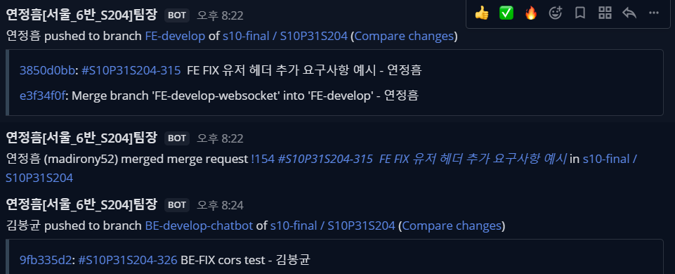
<br /><br />
