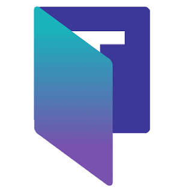

# forTeams

# 프로젝트 소개

### 사내 MS Teams 활성화를 위한 MS Teams 가이드 챗봇 with 포스코인터내셔널

## 프로젝트 기간

```
2024.04.08 ~ 2024.05.17
```

## 팀원

<table>
    <tr height="140px">
        <td align="center" width="150px">
            <a href="https://github.com/madirony"></a>
            <br />
            <a href="https://github.com/madirony">♠️연정흠</a>
        </td>
        <td align="center" width="150px">
            <a href="https://github.com/seroh00"></a>
            <br />
            <a href="https://github.com/seroh00">노성은</a>
        </td>
        <td align="center" width="150px">
            <a href="https://github.com/waterlee6"></a>
            <br />
            <a href="https://github.com/waterlee6">이수민</a>
        </td>
        <td align="center" width="150px">
            <a href="https://github.com/qhdrnak"></a>
            <br />
            <a href="https://github.com/qhdrnak">김봉균</a>
        </td>
        <td align="center" width="130px">
            <a href="https://github.com/soyoungSoyoung"></a>
            <br />
            <a href="https://github.com/soyoungSoyoung">박소영</a>
        </td>
        <td align="center" width="150px">
            <a href="https://github.com/devjun20"></a>
            <br />
            <a href="https://github.com/devjun20">손준성</a>
        </td>
      <tr height="50px">
        <td align="center">
          <p>[BE]</p>
        </td>
        <td align="center">
          <p>[FE]</p>
        </td>
        <td align="center">
          <p>[FE]</p>
        </td>
        <td align="center">
          <p>[BE]</p>
        </td>
        <td align="center">
          <p>[Infra]</p>
        </td>
        <td align="center">
          <p>[AI]</p>
        </td>
    </tr>
    </tr>
</table>

## Youtube
[](https://www.youtube.com/watch?v=9MnvOsJy6fM)

## 링크
https://forteams.co.kr/
<br /><br />
[](https://imaginary-pearl-3f3.notion.site/S204-forTeams-cfd9fd21699e4948a3a8533a9bb80376)

[](https://www.erdcloud.com/)

[](https://www.figma.com/design/4MNk1tuUaO6pIvfV3N9TRM/forTeams?node-id=0%3A1&t=2EA75pePkTOaEuWH-1)

<br />

# 개발 환경 / 기술 스택

### COMMON


### FRONT


### BACK


### AI


### DEV TOOL & etc


# 기능 및 시연
## 기능
### 대략적인 메뉴 설명들 어쩌구
### 저쩌구 gif 포함
## 기술 상세
### 랭체인 같은거 어쩌구 저쩌구
### 차별점 어쩌구 저쩌구

# 시스템 아키텍처

# Figma

# ERD

# 디렉토리 구조
## Front
## Back

## Webhook 활용 알림
